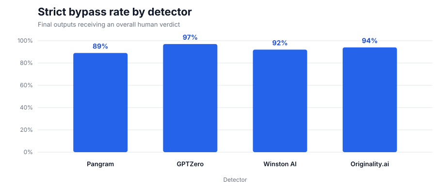
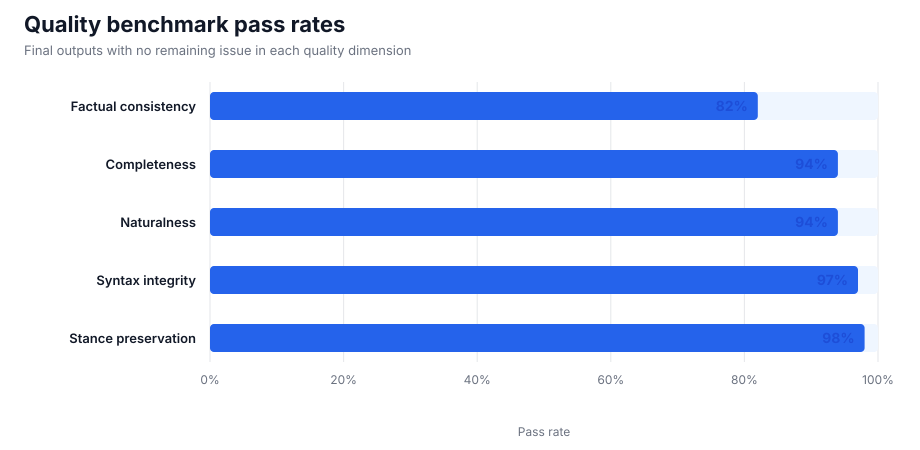

# StealthGPT Super: Benchmark Report

[Terms and methodology](../../README.md)

## Run details

| Field | Value |
|---|---|
| Date | September 7, 2026 |
| Operator | StealthGPT Labs |
| Humanizer | StealthGPT Super, latest model |
| Sample | 100 English production outputs |
| Selection | Random |
| Detector access | Provider APIs |
| Text evaluated | Same output sent to every detector |

## Detector results

| Detector | Model | Resolved version | Mean human score | Median human score | Strict bypass |
|---|---:|---:|---:|---:|---:|
| Pangram | v4 | — | 90.38% | 100% | 89% |
| GPTZero | `latest` | 2026-08-09-base | 96.85% | 100% | 97% |
| Winston AI | `latest` | 4.18 | 91.88% | 100% | 92% |
| Originality.ai | `turbo` | — | 93.71% | 100% | 94% |

## Quality results

| Quality benchmark | Pass rate |
|---|---:|
| Factual consistency | 82% |
| Completeness | 94% |
| Naturalness | 94% |
| Syntax integrity | 97% |
| Stance preservation | 98% |

## Files

- [Anonymized per-output scores](data/scores.csv)
- [Machine-readable summary](data/summary.json)
