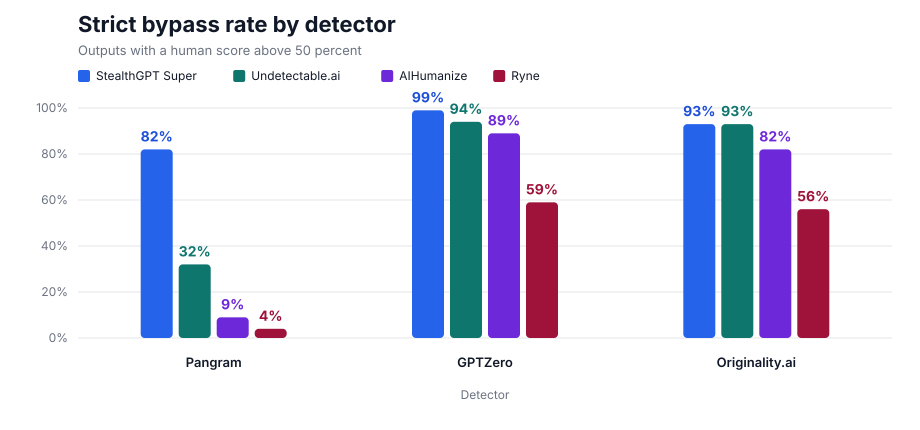
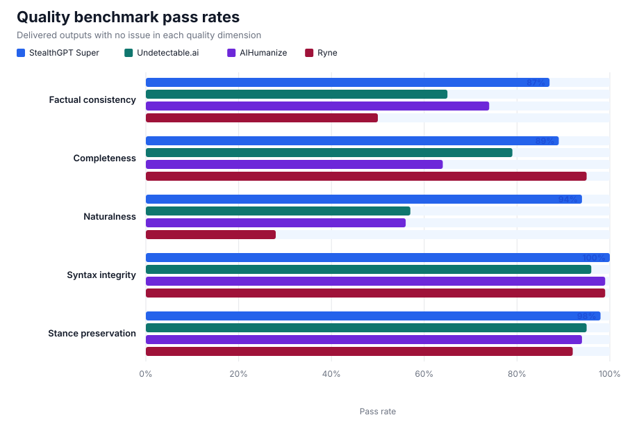

# Humanizer comparison: Benchmark Report

[Terms and methodology](../../README.md)

## Run details

| Field | Value |
|---|---|
| Date | September 8, 2026 |
| Operator | StealthGPT Labs |
| Humanizers | StealthGPT Super, Undetectable.ai, AIHumanize, Ryne |
| Sample | 100 English production outputs |
| Selection | Same source texts for every humanizer |
| Detector access | Provider APIs |
| Text evaluated | Same output sent to every detector |

## Detector results

### StealthGPT Super

| Detector | Model | Resolved version | Mean human score | Median human score | Strict bypass |
|---|---:|---:|---:|---:|---:|
| Pangram | v4 | — | 81.56% | 100% | 82% |
| GPTZero | `latest` | 2026-08-09-base | 97.99% | 100% | 99% |
| Originality.ai | `turbo` | — | 92.32% | 99.99% | 93% |

### Undetectable.ai

| Detector | Model | Resolved version | Mean human score | Median human score | Strict bypass |
|---|---:|---:|---:|---:|---:|
| Pangram | v4 | — | 33.01% | 0% | 32% |
| GPTZero | `latest` | 2026-08-09-base | 92.20% | 100% | 94% |
| Originality.ai | `turbo` | — | 92.80% | 100% | 93% |

### AIHumanize

| Detector | Model | Resolved version | Mean human score | Median human score | Strict bypass |
|---|---:|---:|---:|---:|---:|
| Pangram | v4 | — | 8.30% | 0% | 9% |
| GPTZero | `latest` | 2026-08-09-base | 89.22% | 100% | 89% |
| Originality.ai | `turbo` | — | 84.02% | 99.72% | 82% |

### Ryne

| Detector | Model | Resolved version | Mean human score | Median human score | Strict bypass |
|---|---:|---:|---:|---:|---:|
| Pangram | v4 | — | 4.59% | 0% | 4% |
| GPTZero | `latest` | 2026-08-09-base | 61.13% | 100% | 59% |
| Originality.ai | `turbo` | — | 59.51% | 56.74% | 56% |

## Quality results

### StealthGPT Super

| Quality benchmark | Pass rate |
|---|---:|
| Factual consistency | 87% |
| Completeness | 89% |
| Naturalness | 94% |
| Syntax integrity | 100% |
| Stance preservation | 98% |

### Undetectable.ai

| Quality benchmark | Pass rate |
|---|---:|
| Factual consistency | 65% |
| Completeness | 79% |
| Naturalness | 57% |
| Syntax integrity | 96% |
| Stance preservation | 95% |

### AIHumanize

| Quality benchmark | Pass rate |
|---|---:|
| Factual consistency | 74% |
| Completeness | 64% |
| Naturalness | 56% |
| Syntax integrity | 99% |
| Stance preservation | 94% |

### Ryne

| Quality benchmark | Pass rate |
|---|---:|
| Factual consistency | 50% |
| Completeness | 95% |
| Naturalness | 28% |
| Syntax integrity | 99% |
| Stance preservation | 92% |

## Files

- [Anonymized per-output scores](data/scores.csv)
- [Machine-readable summary](data/summary.json)
