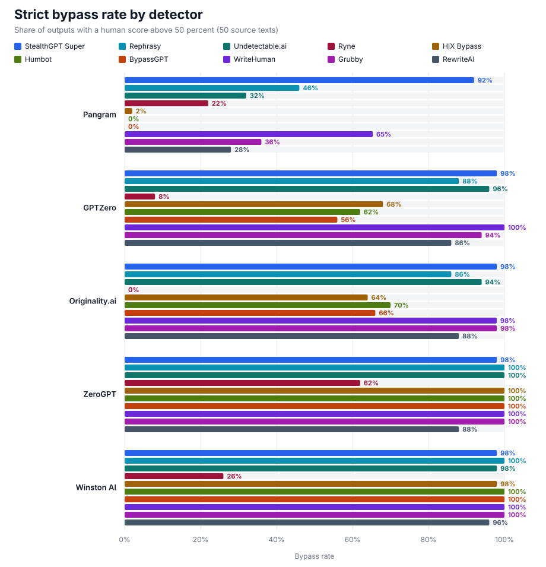
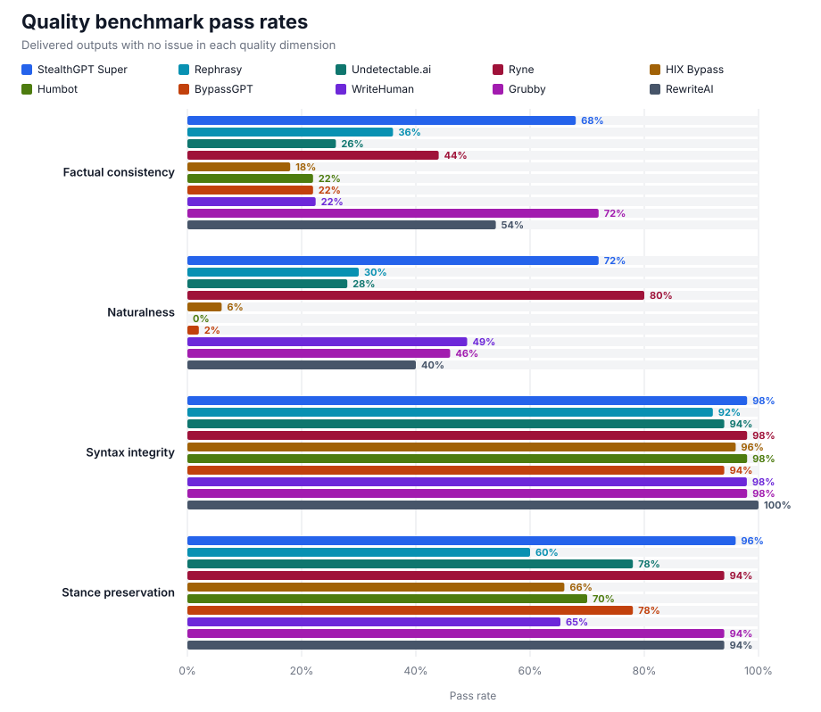

# Humanizer comparison: Benchmark Report

[Terms and methodology](../../README.md)

## Run details

| Field | Value |
|---|---|
| Date | September 30, 2026 |
| Humanizers | StealthGPT Super, Rephrasy, Undetectable.ai, Ryne, HIX Bypass, Humbot, BypassGPT, WriteHuman, Grubby, RewriteAI |
| Sample | 50 English production outputs, 300–1,000 words |
| Selection | Same source texts for every humanizer |
| Detector access | Provider APIs |
| Text evaluated | Same plain-text output sent to every detector |

## Detector results

| Detector | Model | Resolved version |
|---|---:|---:|
| Pangram | v4 | 4.0 |
| GPTZero | `latest` | 2026-09-13-base |
| Originality.ai | turbo | — |
| ZeroGPT | `default` | — |
| Winston AI | `latest` | 5.0 |

Strict bypass rate:

| Humanizer | Pangram | GPTZero | Originality.ai | ZeroGPT | Winston AI |
|---|---:|---:|---:|---:|---:|
| StealthGPT Super | 92% | 98% | 98% | 98% | 98% |
| Rephrasy | 46% | 88% | 86% | 100% | 100% |
| Undetectable.ai | 32% | 96% | 94% | 100% | 98% |
| Ryne | 22% | 8% | 0% | 62% | 26% |
| HIX Bypass | 2% | 68% | 64% | 100% | 98% |
| Humbot | 0% | 62% | 70% | 100% | 100% |
| BypassGPT | 0% | 56% | 66% | 100% | 100% |
| WriteHuman | 65% | 100% | 98% | 100% | 100% |
| Grubby | 36% | 94% | 98% | 100% | 100% |
| RewriteAI | 28% | 86% | 88% | 88% | 96% |

## Quality results

| Humanizer | Factual consistency | Naturalness | Syntax integrity | Stance preservation |
|---|---:|---:|---:|---:|
| StealthGPT Super | 68% | 72% | 98% | 96% |
| Rephrasy | 36% | 30% | 92% | 60% |
| Undetectable.ai | 26% | 28% | 94% | 78% |
| Ryne | 44% | 80% | 98% | 94% |
| HIX Bypass | 18% | 6% | 96% | 66% |
| Humbot | 22% | 0% | 98% | 70% |
| BypassGPT | 22% | 2% | 94% | 78% |
| WriteHuman | 22% | 49% | 98% | 65% |
| Grubby | 72% | 46% | 98% | 94% |
| RewriteAI | 54% | 40% | 100% | 94% |

## Notes

- WriteHuman declined one source text through its content filter, so its results cover 49 outputs.

## Files

- [Anonymized per-output scores](data/scores.csv)
- [Machine-readable summary](data/summary.json)
